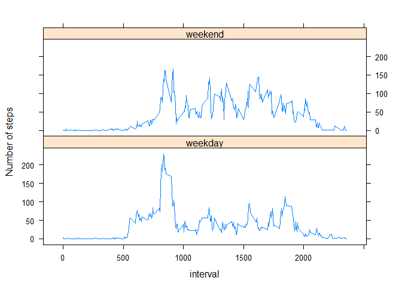

# Reproducible Research: Peer Assessment 1

Using library dplyr


```r
library(dplyr)
```

## Loading and preprocessing the data

Define the file names for the ZIP and CSV files


```r
zip.file  <- "activity.zip"
data.file <- "activity.csv"
```

Unzip the file if needed


```r
if(!file.exists(data.file)) {
  unzip(zip.file)
}
```

Read the CSV file


```r
data.set <- read.csv(data.file)
```

Convert the date to the POSIX and check out the result


```r
data.set$date <- as.POSIXct(data.set$date)
str(data.set)
```

```
## 'data.frame':	17568 obs. of  3 variables:
##  $ steps   : int  NA NA NA NA NA NA NA NA NA NA ...
##  $ date    : POSIXct, format: "2012-10-01" "2012-10-01" ...
##  $ interval: int  0 5 10 15 20 25 30 35 40 45 ...
```

```r
head(data.set)
```

```
##   steps       date interval
## 1    NA 2012-10-01        0
## 2    NA 2012-10-01        5
## 3    NA 2012-10-01       10
## 4    NA 2012-10-01       15
## 5    NA 2012-10-01       20
## 6    NA 2012-10-01       25
```

## What is mean total number of steps taken per day?

Calculate the total number of steps taken per day


```r
nsteps.by.date <- data.set %>% 
  group_by(date) %>% 
  summarise(nsteps=sum(steps, na.rm=T))

head(nsteps.by.date)
```

```
## Source: local data frame [6 x 2]
## 
##         date nsteps
##       (time)  (int)
## 1 2012-10-01      0
## 2 2012-10-02    126
## 3 2012-10-03  11352
## 4 2012-10-04  12116
## 5 2012-10-05  13294
## 6 2012-10-06  15420
```

Make a histogram of the total number of steps taken each day


```r
hist(nsteps.by.date$nsteps, breaks=25, col="wheat", 
     main="Histogram - number of steps per day", 
     xlab="number of steps", ylab="Frequency")
```

 

Calculate and report the mean and median total number of steps taken per day


```r
mean(nsteps.by.date$nsteps)
```

```
## [1] 9354.23
```

```r
median(nsteps.by.date$nsteps)
```

```
## [1] 10395
```


## What is the average daily activity pattern?

Make a time series plot (i.e. type = "l") of the 5-minute interval (x-axis) and the average number of steps taken, averaged across all days (y-axis)


```r
mean.steps.by.interval <- data.set  %>% 
  group_by(interval) %>% 
  summarise(mean.steps=mean(steps, na.rm=T))

plot(mean.steps.by.interval, type="l", col="green")
```

 

Which 5-minute interval, on average across all the days in the dataset, contains the maximum number of steps?


```r
mean.steps.by.interval %>% filter(mean.steps==max(mean.steps))
```

```
## Source: local data frame [1 x 2]
## 
##   interval mean.steps
##      (int)      (dbl)
## 1      835   206.1698
```

## Imputing missing values

Calculate and report the total number of missing values in the dataset (i.e. the total number of rows with NAs)


```r
number.na <- sum(is.na(data.set$steps))
number.na
```

```
## [1] 2304
```

Replacing NAs with the mean for the correwsponding interval all days


```r
f.na.mean <- function(x) { 
  ifelse(is.na(x), 
         mean(x, na.rm=TRUE), 
         x) 
}

data.imputed <- data.set %>%  
  group_by(interval) %>% 
  mutate(steps=f.na.mean(steps)  )

head(data.imputed)
```

```
## Source: local data frame [6 x 3]
## Groups: interval [6]
## 
##       steps       date interval
##       (dbl)     (time)    (int)
## 1 1.7169811 2012-10-01        0
## 2 0.3396226 2012-10-01        5
## 3 0.1320755 2012-10-01       10
## 4 0.1509434 2012-10-01       15
## 5 0.0754717 2012-10-01       20
## 6 2.0943396 2012-10-01       25
```

Make a histogram of the total number of steps taken each day


```r
nsteps.by.date.imp <- data.imputed %>% 
  group_by(date) %>% 
  summarise(nsteps=sum(steps))

head(nsteps.by.date.imp)
```

```
## Source: local data frame [6 x 2]
## 
##         date   nsteps
##       (time)    (dbl)
## 1 2012-10-01 10766.19
## 2 2012-10-02   126.00
## 3 2012-10-03 11352.00
## 4 2012-10-04 12116.00
## 5 2012-10-05 13294.00
## 6 2012-10-06 15420.00
```

```r
hist(nsteps.by.date.imp$nsteps, breaks=25, col="wheat", 
     main="Histogram - number of steps per day", 
     xlab="number of steps", ylab="Frequency")
```

 

Calculate and report the mean and median total number of steps taken per day. 


```r
c( mean(nsteps.by.date.imp$nsteps), median(nsteps.by.date.imp$nsteps) )
```

```
## [1] 10766.19 10766.19
```

Do these values differ from the estimates from the first part of the assignment? What is the impact of imputing missing data on the estimates of the total daily number of steps?


```r
c( sum(data.set$steps, na.rm = TRUE), sum(data.imputed$steps) )
```

```
## [1] 570608.0 656737.5
```

Yes, they are different from the case where the NAs wereignored. Now the NAs are part of the calculation which produces higher values and smoother distribution - visualized on the histogram above.


## Are there differences in activity patterns between weekdays and weekends?

Create a new factor variable in the dataset with two levels – “weekday” and “weekend” indicating whether a given date is a weekday or weekend day.


```r
wday.factor <- function(x) {
  wday <- ifelse( weekdays(x)=="Saturday" | weekdays(x)=="Sunday",
                  "weekend", 
                  "weekday")
  as.factor(wday)
}

data.imputed$wday <- wday.factor(data.imputed$date)

head(data.imputed)
```

```
## Source: local data frame [6 x 4]
## Groups: interval [6]
## 
##       steps       date interval    wday
##       (dbl)     (time)    (int)  (fctr)
## 1 1.7169811 2012-10-01        0 weekday
## 2 0.3396226 2012-10-01        5 weekday
## 3 0.1320755 2012-10-01       10 weekday
## 4 0.1509434 2012-10-01       15 weekday
## 5 0.0754717 2012-10-01       20 weekday
## 6 2.0943396 2012-10-01       25 weekday
```

Make a panel plot containing a time series plot (i.e. type = "l") of the 5-minute interval (x-axis) and the average number of steps taken, averaged across all weekday days or weekend days (y-axis). See the README file in the GitHub repository to see an example of what this plot should look like using simulated data.


```r
library(lattice) 

mean.steps.by.interval.imp <- data.imputed  %>% 
  group_by(interval, wday) %>% 
  summarise(mean.steps=mean(steps))

xyplot(mean.steps~interval|wday, 
       type="l", 
       data = mean.steps.by.interval.imp, 
       layout=c(1,2),
       ylab = "Number of steps")
```

 


